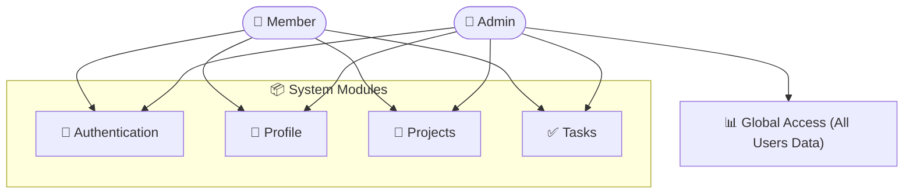
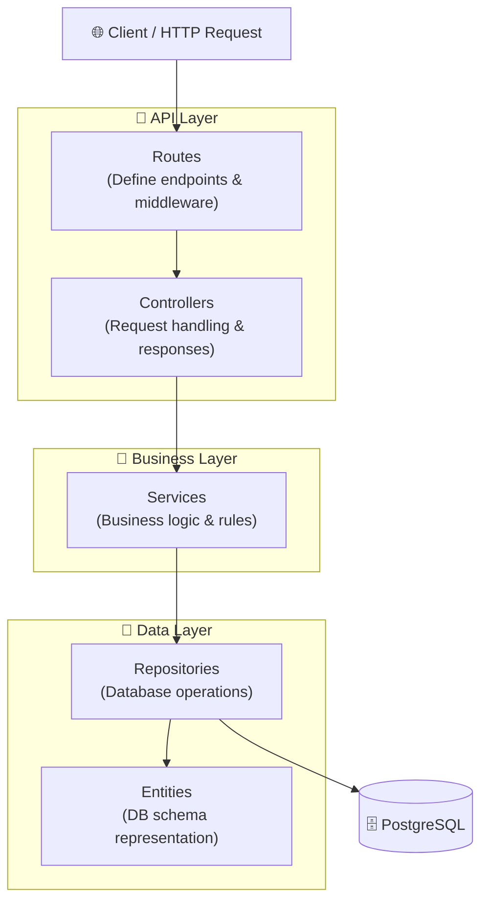
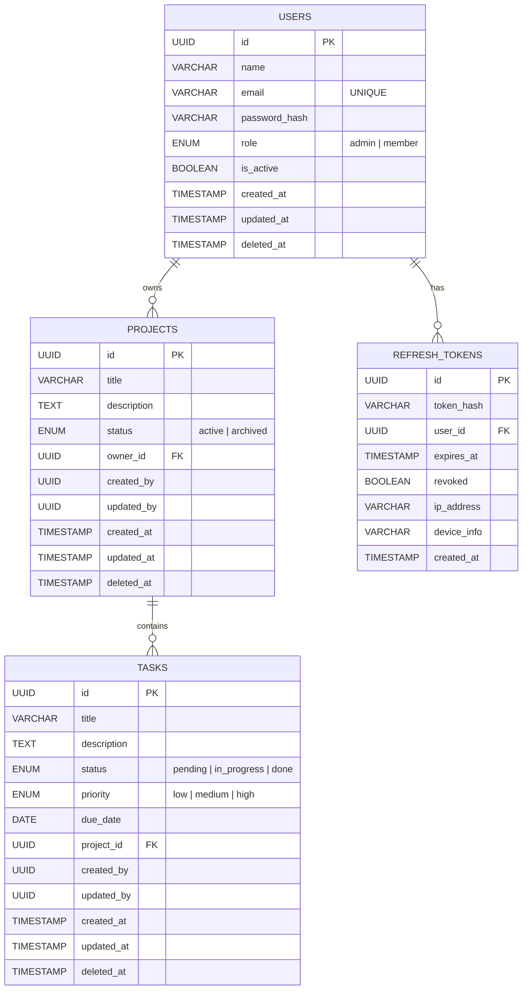

# Project & Task Management API

> A production-ready RESTful API for managing projects and tasks, built with Node.js, TypeScript, Express.js, PostgreSQL, and TypeORM.


---

## Features

**Authentication & Authorization**
- User registration & login with JWT
- Refresh token rotation with HttpOnly cookies
- Role-based access control (Admin / Member)
- Ownership authorization — users can only access their own resources

**Project Management**
- Full CRUD with soft delete
- Search, pagination & sorting

**Task Management**
- Full CRUD with soft delete
- Filter by status & priority
- Search, pagination & sorting

**Developer Experience**
- Swagger UI at `/api/docs`
- Global error handling
- Request validation with Zod
- Docker Compose support
- Database migrations & seeders

---

## Use Case Diagram



---

## Tech Stack

| Category        | Technology              |
|----------------|--------------------------|
| Runtime         | Node.js v18+            |
| Language        | TypeScript               |
| Framework       | Express.js               |
| Database        | PostgreSQL                |
| ORM             | TypeORM                  |
| Authentication  | JWT + Refresh Tokens     |
| Validation      | Zod                      |
| Password Hashing| bcrypt                   |
| Documentation   | Swagger / OpenAPI        |
| Containerization| Docker                   |

---

## Architecture

The application follows a **Layered Architecture** with the **Repository Pattern**:



---

## Database Design



---

## API Overview

> Full interactive documentation available at: **`http://localhost:3000/api/docs`**

### Auth — `/api/auth`
| Method | Endpoint              | Description                        |
|--------|-----------------------|------------------------------------|
| POST   | `/api/auth/register`  | Register a new user                |
| POST   | `/api/auth/login`     | Login and receive access token     |
| POST   | `/api/auth/refresh`   | Refresh access token via cookie    |
| POST   | `/api/auth/logout`    | Revoke refresh token               |

### Users — `/api/users`
| Method | Endpoint         | Description              |
|--------|------------------|--------------------------|
| GET    | `/api/users/me`  | Get authenticated user   |
| PATCH  | `/api/users/me`  | Update profile           |
| DELETE | `/api/users/me`  | Delete account           |

### Projects — `/api/projects`
| Method | Endpoint             | Description            |
|--------|----------------------|------------------------|
| POST   | `/api/projects`      | Create project         |
| GET    | `/api/projects`      | Get all user projects  |
| GET    | `/api/projects/:id`  | Get project by ID      |
| PATCH  | `/api/projects/:id`  | Update project         |
| DELETE | `/api/projects/:id`  | Soft delete project    |

### Tasks — `/api/projects/:projectId/tasks`
| Method | Endpoint                               | Description        |
|--------|----------------------------------------|--------------------|
| POST   | `/api/projects/:projectId/tasks`       | Create task        |
| GET    | `/api/projects/:projectId/tasks`       | Get project tasks  |
| GET    | `/api/projects/:projectId/tasks/:id`   | Get task by ID     |
| PATCH  | `/api/projects/:projectId/tasks/:id`   | Update task        |
| DELETE | `/api/projects/:projectId/tasks/:id`   | Soft delete task   |

### Query Parameters (List Endpoints)

| Parameter | Type   | Example                  |
|-----------|--------|--------------------------|
| page      | number | `?page=1`                |
| limit     | number | `?limit=10`              |
| sort      | string | `?sort=createdAt`        |
| order     | string | `?order=desc`            |
| search    | string | `?search=backend`        |
| status    | string | `?status=done`           |
| priority  | string | `?priority=high`         |

---

## Project Structure

```
src/
├── config/
│   ├── database.ts
│   └── env.ts
├── database/
│   ├── migrations/
│   └── seeds/
├── common/
│   ├── enums/
│   ├── exceptions/
│   ├── middlewares/
│   ├── types/
│   └── utils/
└── modules/
    ├── auth/
    │   ├── dto/
    │   ├── validations/
    │   ├── repositories/
    │   ├── auth.controller.ts
    │   ├── auth.service.ts
    │   └── auth.routes.ts
    ├── users/
    │   ├── dto/
    │   ├── entities/
    │   ├── repositories/
    │   ├── user.controller.ts
    │   ├── user.service.ts
    │   └── user.routes.ts
    ├── projects/
    │   ├── dto/
    │   ├── validations/
    │   ├── entities/
    │   ├── repositories/
    │   ├── project.controller.ts
    │   ├── project.service.ts
    │   └── project.routes.ts
    └── tasks/
        ├── dto/
        ├── validations/
        ├── entities/
        ├── repositories/
        ├── task.controller.ts
        ├── task.service.ts
        └── task.routes.ts
```

---

## Environment Variables

Copy `.env.example` to `.env` and fill in your values:

```env
# App
PORT=3000
NODE_ENV=development

# Database
DB_HOST=localhost
DB_PORT=5432
DB_NAME=project_management
DB_USER=postgres
DB_PASSWORD=your_password

# JWT
JWT_SECRET=your_access_secret
JWT_EXPIRES_IN=15m

JWT_REFRESH_SECRET=your_refresh_secret
JWT_REFRESH_EXPIRES_IN=7d

# Cookie
COOKIE_SECRET=your_cookie_secret
```

---

## Installation

**Prerequisites:** Node.js v18+, PostgreSQL

```bash
# 1. Clone the repository
git clone https://github.com/your-username/project-task-management-api.git
cd project-task-management-api

# 2. Install dependencies
npm install

# 3. Set up environment variables
cp .env.example .env

# 4. Run database migrations
npm run migration:run

# 5. (Optional) Seed the database
npm run seed

# 6. Start development server
npm run dev
```

---

## Docker

```bash
# Start all services
docker-compose up --build

# Stop containers
docker-compose down
```

---

## API Documentation

Swagger UI is available at:

```
http://localhost:3000/api/docs
```

---

## Roles & Permissions

| Action                     | Member | Admin |
|---------------------------|--------|-------|
| Manage own profile        | ✅     | ✅    |
| Manage own projects       | ✅     | ✅    |
| Manage own tasks          | ✅     | ✅    |
| Access other users' data  | ❌     | ✅    |
| Access all projects       | ❌     | ✅    |
| Manage user accounts      | ❌     | ✅    |

---

## Bonus Features

- ✅ TypeScript
- ✅ Repository Pattern
- ✅ Refresh Token Rotation
- ✅ RBAC (Admin / Member)
- ✅ Soft Delete
- ✅ Ownership Authorization
- ✅ Search, Pagination & Sorting
- ✅ Swagger Documentation
- ✅ Docker Compose
- ✅ Database Migrations & Seeders
- ✅ Global Error Handling
